<!-- ============================== HEADER ============================== -->
<p align="center">
  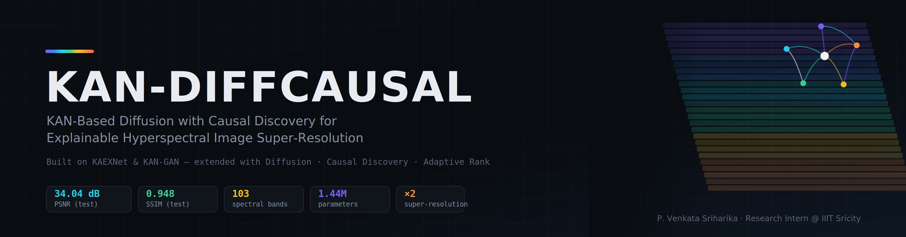
</p>

<p align="center">
  
</p>

<h1 align="center">🛰️ KAN-DiffCausal</h1>

<p align="center">
  <a href="https://git.io/typing-svg">
    
  </a>
</p>

<p align="center">
  
  
  
</p>

<p align="center">
  
  
  
  
  
  
</p>

<p align="center">
  <b>P. Venkata Sriharika</b> · Research Intern, SAMI Lab, IIIT Sricity<br>
  <sub>ISRO-funded project · Supervised by <b>[Professor's Name]</b></sub>
</p>

<p align="center">
  <a href="#-highlights">Highlights</a> ·
  <a href="#-architecture">Architecture</a> ·
  <a href="#-results">Results</a> ·
  <a href="#-explainability">Explainability</a> ·
  <a href="#-honest-limitations">Limitations</a> ·
  <a href="#-getting-started">Getting Started</a>
</p>

---

## ✨ Highlights

KAN-DiffCausal reconstructs a **64×64×103** hyperspectral cube from a **32×32×103** observation (×2 super-resolution) **and** reports which spectral bands drove the reconstruction.

| | |
|---|---|
| 🧠 **KAN backbone** | Every learnable block is built from **FastKAN** convolutions (RBF-based learnable activations on edges). |
| 🔍 **Learnable upsampling** | PixelShuffle upsampler replaces fixed bilinear interpolation. |
| 🌫️ **Diffusion-style refinement** | A timestep-conditioned residual denoiser replaces adversarial GAN training. One loss, no min–max game. |
| 🎚️ **Adaptive spectral rank** | A per-pixel rank map (16 → 64) allocates capacity where the scene is spectrally complex. |
| 🔬 **Explainability** | A band-importance (causal) graph, validated with a perturbation-based faithfulness test. |
| 🧪 **Physics-guided unmixing** | Softmax abundances over 9 endmembers act as an auxiliary signal and an extra visual check. |
| 🪶 **Lightweight** | **1,444,958** trainable parameters, about one hour of training on a single GPU. |

<div align="center">

| 📈 PSNR | 🧱 SSIM | 📐 SAM | 🧮 RMSE | 🛰️ ERGAS |
|:---:|:---:|:---:|:---:|:---:|
| **34.04 dB** | **0.9480** | **3.10°** | **0.0164** | **5.25** |

<sub>Held-out test set of 483 patches · Pavia University · ×2</sub>

</div>

---

## 🧬 Lineage: built on KAEXNet and KAN-GAN

<p align="center">
  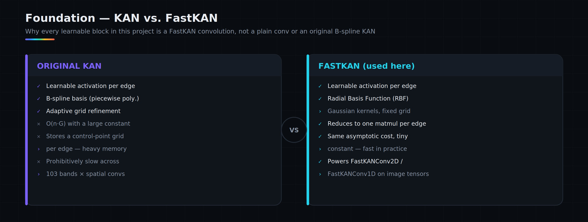
</p>

KAN-DiffCausal is an **extension**, not a rewrite. It keeps KAEXNet's rank-compression framing and evaluation suite, plus the FastKAN convolution substrate from KAN-GAN / FBD-KAN. It replaces three weak links and adds a new explainability layer.

<p align="center">
  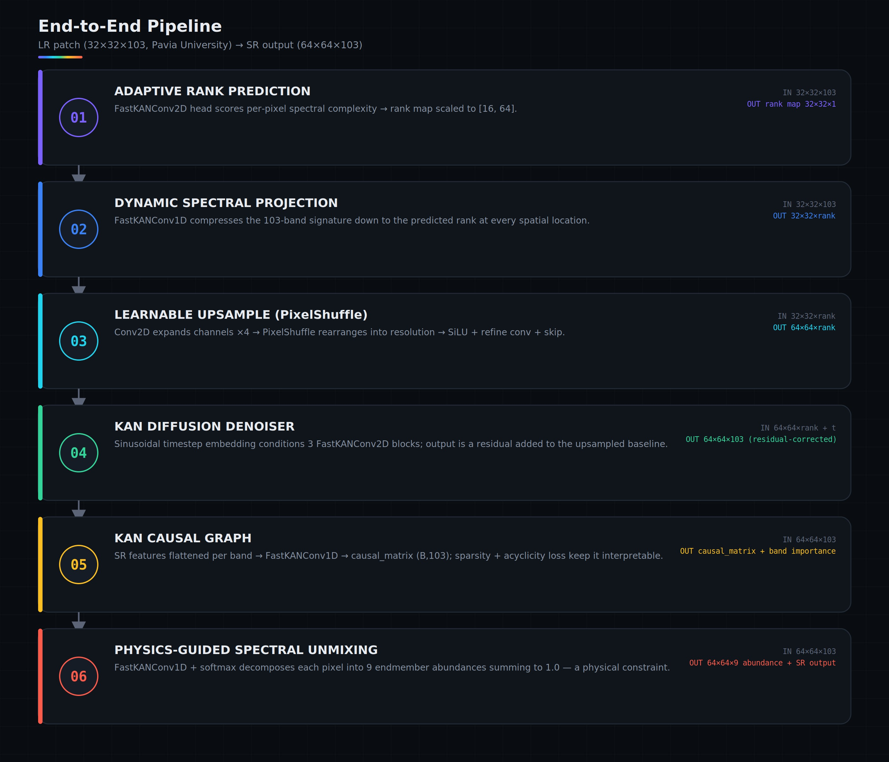
</p>

| Gap in prior work | What KAN-DiffCausal does instead |
|---|---|
| Fixed bilinear upsampling | Learnable **PixelShuffle** upsampler |
| One-shot reconstruction, no refinement | **Residual diffusion denoiser** with timestep conditioning |
| One fixed spectral rank for every pixel | **Adaptive per-pixel rank** predictor (16–64) |
| Bands treated as independent channels | **Band-importance graph** + attention-based pairwise matrix |

---

## 🗺️ Methodology at a glance

<p align="center">
  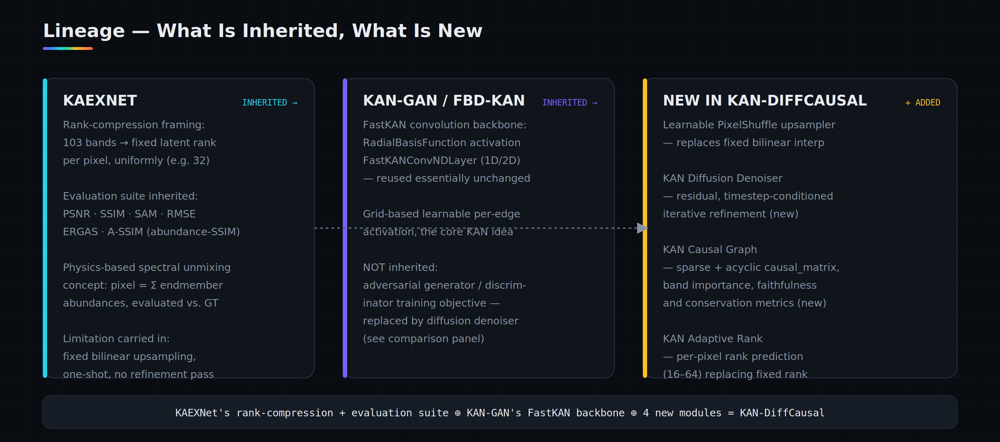
</p>

<details>
<summary><b>📚 Why KAN? KAN vs FastKAN (click to expand)</b></summary>

<p align="center">
  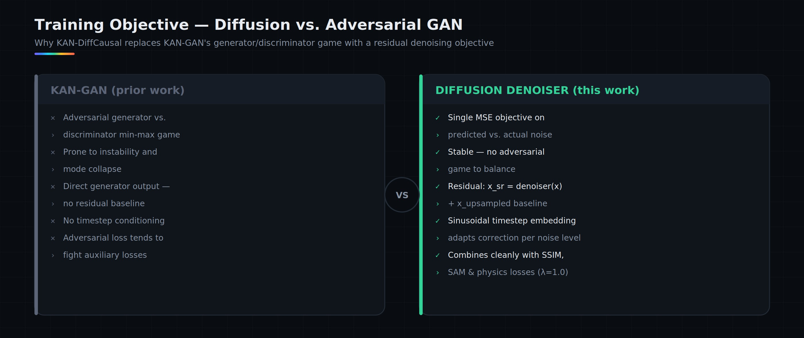
</p>

A Kolmogorov–Arnold Network puts **learnable activation functions on the edges** instead of fixed activations on the nodes. The original formulation uses B-splines, which are expensive for image-shaped tensors. **FastKAN** swaps B-splines for Gaussian **radial basis functions**, which reduces the activation to a single matrix multiplication and makes KAN layers practical inside convolutions (`FastKANConv1D` and `FastKANConv2D`).

</details>

---

## 🏗️ Architecture

<p align="center">
  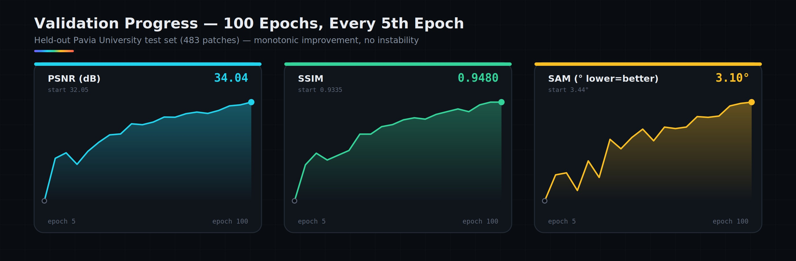
</p>

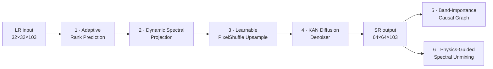

| Stage | Module | Role |
|:---:|---|---|
| 1 | **Adaptive Rank** | FastKAN head predicts a spectral-complexity score per pixel, mapped into a rank between 16 and 64. |
| 2 | **Dynamic Spectral Projection** | FastKAN 1D conv compresses the 103 bands into a compact subspace. |
| 3 | **Learnable Upsample** | Conv → PixelShuffle → SiLU → refinement conv, with a skip connection. |
| 4 | **KAN Diffusion Denoiser** | Sinusoidal timestep embedding + FastKAN blocks predict a residual correction. The decoder is near-zero initialised, so training starts from an identity upsampler. |
| 5 | **KAN Causal Graph** | Produces a signed per-band score matrix with sparsity and acyclicity regularisation. |
| 6 | **Spectral Unmixing** | Softmax over 9 endmembers; abundance maps act as a physical sanity check. |

<details>
<summary><b>🌫️ Why diffusion instead of a GAN? (click to expand)</b></summary>

<p align="center">
  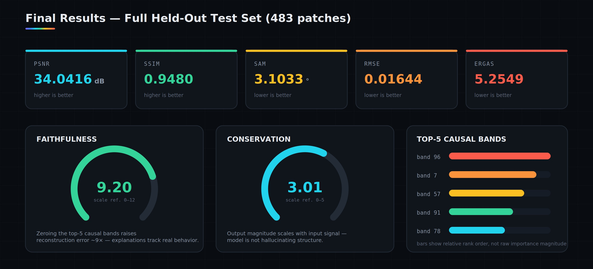
</p>

The denoiser is trained with a single, non-adversarial MSE objective on predicted vs. added noise. There is no discriminator to balance, and the loss combines cleanly with the reconstruction, SSIM, SAM, rank and physics terms in one joint objective.

</details>

---

## 🔁 Experimental workflow

<p align="center">
  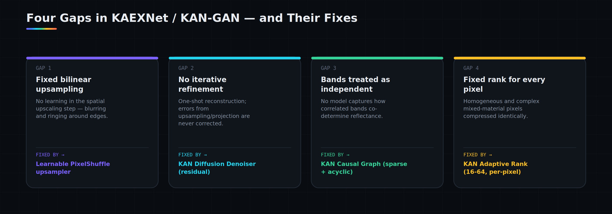
</p>

---

## 📊 Results

### Validation across training

<p align="center">
  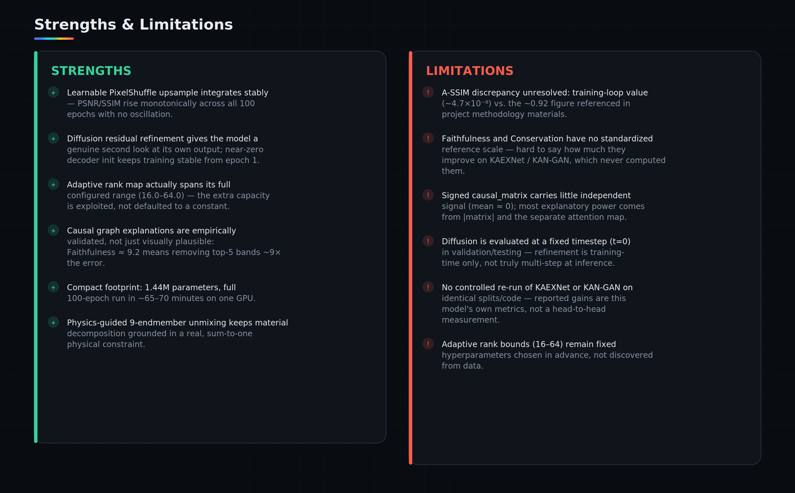
</p>

| Epoch | PSNR (dB) | SSIM | SAM (°) |
|---:|---:|---:|---:|
| 5 | 32.05 | 0.9335 | 3.44 |
| 10 | 32.91 | 0.9388 | 3.35 |
| 20 | 32.79 | 0.9395 | 3.40 |
| 30 | 33.23 | 0.9409 | 3.36 |
| 40 | 33.40 | 0.9433 | 3.26 |
| 50 | 33.59 | 0.9447 | 3.19 |
| 60 | 33.74 | 0.9457 | 3.19 |
| 70 | 33.81 | 0.9462 | 3.19 |
| 80 | 33.81 | 0.9470 | 3.15 |
| 90 | 33.97 | 0.9476 | 3.12 |
| 100 | **34.04** | **0.9480** | **3.10** |

Training was smooth and close to monotonic, with no collapses or oscillation.

### Final results and explainability dashboard

<p align="center">
  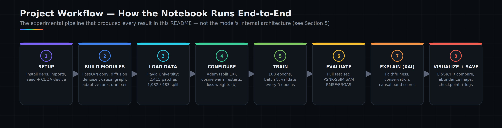
</p>

| Metric | Value |
|---|---:|
| PSNR | 34.0416 dB |
| SSIM | 0.9480 |
| SAM | 3.1033° |
| RMSE | 0.016444 |
| ERGAS | 5.2549 |

---

## 🔬 Explainability

The explanation is *tested*, not just drawn.

| Metric | Value | What it tells you |
|---|---:|---|
| **Faithfulness** | ≈ 9.20 | Zeroing the model's top-5 "important" bands raises reconstruction error roughly **9×** vs. baseline. |
| **Conservation** | ≈ 3.01 | Output change relative to input magnitude (output depends on the input signal). |
| **Top-5 bands** | 96 · 7 · 57 · 91 · 78 | Highest absolute causal-importance bands on the analysed sample. |
| **Adaptive rank range** | 16.0 → 64.0 | The rank head uses its full range, so it is not collapsing to a constant. |

> 💡 Faithfulness works as an intervention test. If the graph's important bands are removed and quality drops sharply, the explanation reflects genuine model dependence.

---

## 🧭 Honest limitations

Being upfront about what this work does **not** show:

- **No head-to-head baseline.** KAEXNet and KAN-GAN were not re-run on the same split here, so the numbers are this model's own performance, not a measured improvement margin.
- **A-SSIM discrepancy.** The abundance-map A-SSIM logged during training (≈ 4.7×10⁻⁸) does not match the ≈ 0.92 figure used elsewhere in the project materials. This is probably a scale or normalisation issue and is unresolved.
- **Diffusion at inference.** Evaluation calls the denoiser at a fixed timestep (t = 0) rather than running multi-step sampling, so refinement mostly comes from training-time noise exposure.
- **"Causal" is a band-importance score.** It is a learned, sparsity-regularised importance graph, not formal causal discovery. The signed matrix has a mean near zero, and most of the interpretable signal comes from its absolute value and the attention-based pairwise matrix.
- **Single dataset.** The explainability results (top bands, faithfulness) are specific to Pavia University.
- **Fixed rank bounds.** The 16–64 range is a hyperparameter, not learned.

---

## ⚙️ Configuration

| Setting | Value |
|---|---|
| Dataset | Pavia University (103 bands) |
| Patches | 2,415 total → **1,932 train / 483 test** (80/20) |
| Input → output | 32×32×103 → 64×64×103 (×2) |
| Epochs / batch size | 100 / 8 |
| Optimiser | Adam, with 1e-3 (FastKAN spline params) and 1e-4 (others) |
| Scheduler | Cosine annealing with warm restarts + 5-epoch linear warmup |
| Gradient clipping | max-norm 1.0 |
| Diffusion | 100 timesteps |
| Latent rank / adaptive range | 32 / 16–64 |
| Endmembers / grid size | 9 / 8 |
| Parameters | **1,444,958** |
| Loss | 7 terms: reconstruction, SSIM, SAM, A-SSIM, causal, rank, diffusion |

---

## 🚀 Getting started

```bash
git clone https://github.com/<your-username>/KAN-DiffCausal.git
cd KAN-DiffCausal
pip install -r requirements.txt
jupyter notebook notebooks/KAN-DiffCausal.ipynb
```

**Data.** The notebook expects paired low-/high-resolution Pavia University patches in two folders (`LR/` and `HR/`). Download the public **Pavia University** scene, extract 32×32 LR / 64×64 HR patches, and update `LR_FOLDER` and `HR_FOLDER` near the top of the notebook (the defaults point to a Kaggle dataset path).

**Outputs.** Checkpoints and TensorBoard logs are written to the output directory set in the notebook.

---

## 📁 Repository structure

```
KAN-DiffCausal/
├── README.md
├── requirements.txt
├── notebooks/
│   └── KAN-DiffCausal.ipynb     # full implementation, training, metrics, XAI
├── report/
│   └── KAN-DiffCausal.pdf       # written report
├── slides/
│   └── KAN-DiffCausal.pptx      # presentation deck
└── images/                      # figures used in this README
```

---

## 🙏 Acknowledgements

- Built on **KAEXNet** and **KAN-GAN / FBD-KAN** from the SAMI Lab. The FastKAN convolution layers are carried over from that work.
- Conducted at **SAMI Lab, IIIT Sricity**, as part of an **ISRO-funded** project, under the supervision of **[Professor's Name]**.
- **Pavia University** hyperspectral scene, a public remote-sensing benchmark.

---

<p align="center">
  <b>P. Venkata Sriharika</b><br>
  <a href="https://www.linkedin.com/in/<venkata-sriharika-prathipati-b9491b300"></a>
  <a href="mailto:sriharikaprathipati@gmail.com"></a>
  <a href="https://github.com/venkatasriharika-code"</a>
</p>

<p align="center">
  
</p>

<p align="center"><sub>⭐ If you found this useful, consider starring the repo.</sub></p>
